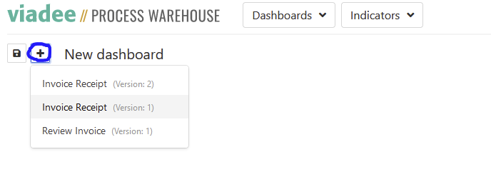
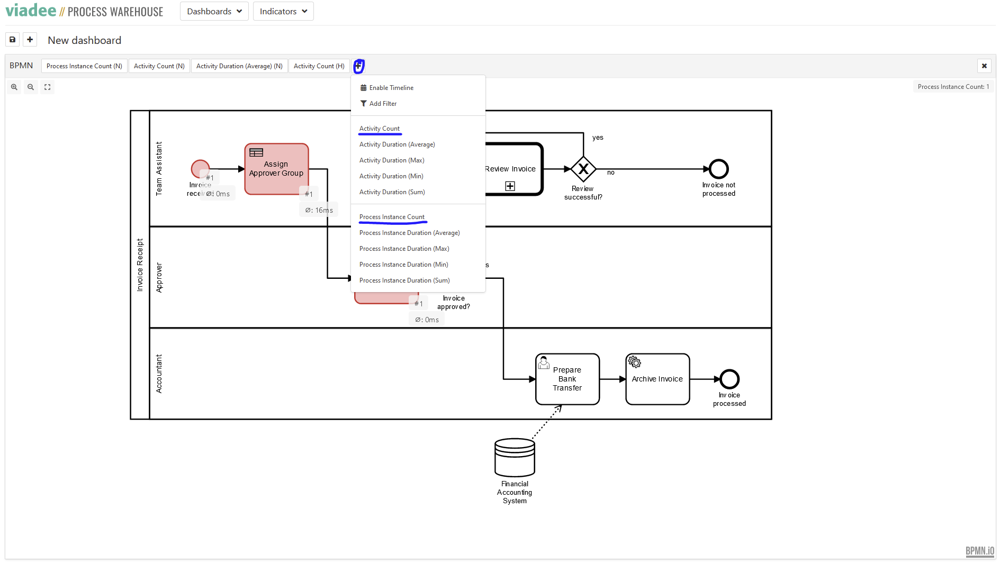

# Getting Started as User 

1. Start you vpw instance (docker-compose or helm) and browse to your `localhost:8080` or exposed ingress address. You 
should see an empty process warehouse-dashboard.

2. Click "plus" and select your process definition you want to add a visualisation for. 

3. You should see the process model of your selected process definition. 
4. Click "plus" on that process definition to select so called indicators on process/activity level. 

5. You could also navigate to `http://localhost:8081/camunda/app/cockpit/default/#/dashboard` to start process instances, complete tasks and see data and events coming in to the process warehouse. 

# Further explanations and tutorials
- Visit our website: https://www.viadee.de/loesungen/business-process-management/process-warehouse
- Watch our introduction and tutorial videos:
    - [viadee Process Warehouse: Definition, Visualisierung und Analyse von Prozessdaten](https://youtu.be/mxOt_LJ8qFg)
    - [viadee Process Warehouse - Enabling Process Excellence](https://youtu.be/n8DVsQQgH_0)
    - [viadee Process Warehouse - Walkthrough](https://youtu.be/2zLa7m1nevs)