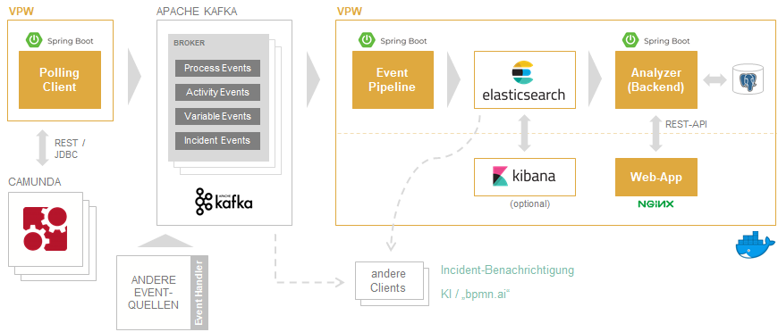

# Overview vPW Architecture

## Components

* **[analyzer](https://github.com/viadee/vPW/tree/main/analyzer)**
    * Spring-Boot-App
    * Provision of a REST API for the vPW frontend
    * Persistence of inventory data (dashboards, indicators) in PostgreSQL
    * Generation of Elasticsearch requests from the frontend requests and processing/preparation of the results
* **[pipeline](https://github.com/viadee/vPW/tree/main/pipeline)**
    * Spring-Boot-App
    * Receiving process data from Kafka
    * Data preparation, including "breaking up" JSON objects into flat structures
    * Storage/indexing in Elasticsearch
* **[vpw-shared-elasticsearch-config](https://github.com/viadee/vPW/tree/main/vpw-shared-elasticsearch-config)**
    * Spring boot AutoConfiguration for the Elasticsearch REST client, used by Analyzer and Pipeline.
* **web-app**
    * Frontend, user interface & dashboard
    * HTML/CSS/Javascript
    * NGINX webserver and reverse proxy
    * Communication with _pipeline_ and _analyzer_ via REST (JSON)
* **[polling-client](https://github.com/viadee/camunda-kafka-polling-client)**
    * extraction of Camunda process data and their permanent storage in Apache Kafka
* **elasticsearch**
    * Central vPW data store and basis for evaluations
    * Simple data model: Process, Activity, Variable (Parent/Child relationships)
    * Key figure calculation "on-the-fly" with ad-hoc queries (filters, aggregations)
* **kibana**
    * Visualization of Elasticsearch data as an addition to the vPW frontend (web-app)

## Characteristics
* Asynchronous processing
    * No influence on normal operation
* Open architecture
    * possible integration of different event sources
    * connection of own clients to Kafka and Elasticsearch
* "Near-real-time" processing
* Scalability and stateless components
* Operation on container platforms